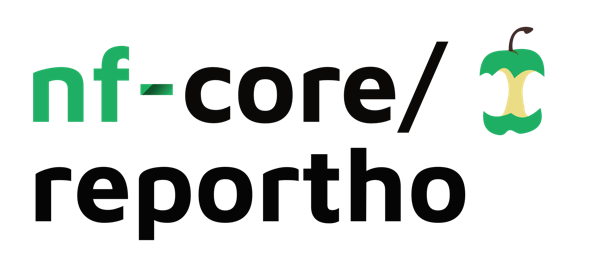

<h1>
  <picture>
    <source media="(prefers-color-scheme: dark)" srcset="docs/images/nf-core-reportho_logo_dark.png">
    
  </picture>
</h1>

[](https://github.com/nf-core/reportho/actions/workflows/ci.yml)
[](https://github.com/nf-core/reportho/actions/workflows/linting.yml)[](https://nf-co.re/reportho/results)[](https://doi.org/10.5281/zenodo.XXXXXXX)
[](https://www.nf-test.com)

[](https://www.nextflow.io/)
[](https://docs.conda.io/en/latest/)
[](https://www.docker.com/)
[](https://sylabs.io/docs/)
[](https://cloud.seqera.io/launch?pipeline=https://github.com/nf-core/reportho)

[](https://nfcore.slack.com/channels/reportho)[](https://twitter.com/nf_core)[](https://mstdn.science/@nf_core)[](https://www.youtube.com/c/nf-core)

## Introduction

**nf-core/reportho** is a bioinformatics pipeline that compares and assembles orthology predictions for a query protein. It fetches ortholog lists for a query (or its closest annotated homolog) from public sources, calculates pairwise and global agreement, and generates a consensus list with the desired level of confidence. Optionally, it offers common analysis on the consensus orthologs, such as MSA and phylogeny reconstruction. Additionally, it generates a clean, human-readable report of the results.

<!-- Tube map -->


1. **Obtain Query Information**: (depends on provided input) identification of Uniprot ID and taxon ID for the query or its closest homolog.
2. **Fetch Orthologs**: fetching of ortholog predictions from public databases, either through API or from local snapshot.
3. **Compare and Assemble**: calculation of agreement statistics, creation of ortholog lists, selection of the consensus list.

Steps that follow can be skipped with `--skip_downstream` in batch analysis.

4. **Fetch Sequences**: fetching of protein sequences for the orthologs from Uniprot.
5. **Fetch Structures**: fetching of protein structure from the AlphaFold Database. Only performed if `--use_structures` is true.
6. **Align Sequences**: multiple sequence alignment. 3D-COFFEE is used if `--use_structures` is true, T-COFFEE otherwise.
7. **Reconstruct Phylogeny**: character-based phylogenetic reconstruction with ML or ME. Only performed if at least one of `--use_iqtree` or `--use_fastme` is true.
8. **Generate Report**: human-readable HTML report generation.

## Usage

> [!NOTE]
> If you are new to Nextflow and nf-core, please refer to [this page](https://nf-co.re/docs/usage/installation) on how to set-up Nextflow. Make sure to [test your setup](https://nf-co.re/docs/usage/introduction#how-to-run-a-pipeline) with `-profile test` before running the workflow on actual data.

First, prepare a samplesheet with your input data that looks as follows:

```csv title="samplesheet_fasta.csv"
id,fasta
BicD2,data/bicd2.fasta
```

or if you know the UniProt ID of the protein you can provide it directly:

```csv title="samplesheet.csv"
id,query
BicD2,Q8TD16
```

> [!NOTE]
> If you provide both a FASTA file and a UniProt ID only the latter will be used.

Now, you can run the pipeline using:

```bash
nextflow run nf-core/reportho \
   -profile <docker/singularity/.../institute> \
   --input samplesheet.csv \
   --outdir <OUTDIR>
```

> [!WARNING]
> Please provide pipeline parameters via the CLI or Nextflow `-params-file` option. Custom config files including those provided by the `-c` Nextflow option can be used to provide any configuration _**except for parameters**_;
> see [docs](https://nf-co.re/usage/configuration#custom-configuration-files).

For more details and further functionality, please refer to the [usage documentation](https://nf-co.re/reportho/usage) and the [parameter documentation](https://nf-co.re/reportho/parameters).

## Pipeline output

To see the results of an example test run with a full size dataset refer to the [results](https://nf-co.re/reportho/results) tab on the nf-core website pipeline page.
For more details about the output files and reports, please refer to the
[output documentation](https://nf-co.re/reportho/output).

## Credits

nf-core/reportho was originally written by Igor Trujnara (@itrujnara).

We thank the following people for their extensive assistance in the development of this pipeline:

- Luisa Santus (@lsantus)
- Alessio Vignoli (@avignoli)
- Jose Espinosa-Carrasco (@JoseEspinosa)

## Contributions and Support

If you would like to contribute to this pipeline, please see the [contributing guidelines](.github/CONTRIBUTING.md).

For further information or help, don't hesitate to get in touch on the [Slack `#reportho` channel](https://nfcore.slack.com/channels/reportho) (you can join with [this invite](https://nf-co.re/join/slack)).

## Citations

<!-- TODO nf-core: Add citation for pipeline after first release. Uncomment lines below and update Zenodo doi and badge at the top of this file. -->
<!-- If you use nf-core/reportho for your analysis, please cite it using the following doi: [10.5281/zenodo.XXXXXX](https://doi.org/10.5281/zenodo.XXXXXX) -->

An extensive list of references for the tools used by the pipeline can be found in the [`CITATIONS.md`](CITATIONS.md) file.

You can cite the `nf-core` publication as follows:

> **The nf-core framework for community-curated bioinformatics pipelines.**
>
> Philip Ewels, Alexander Peltzer, Sven Fillinger, Harshil Patel, Johannes Alneberg, Andreas Wilm, Maxime Ulysse Garcia, Paolo Di Tommaso & Sven Nahnsen.
>
> _Nat Biotechnol._ 2020 Feb 13. doi: [10.1038/s41587-020-0439-x](https://dx.doi.org/10.1038/s41587-020-0439-x).
